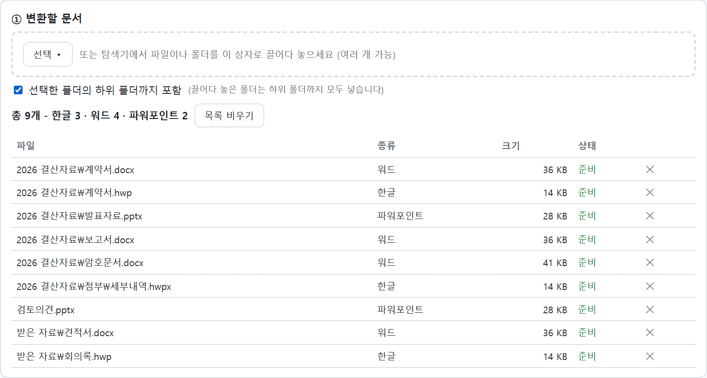
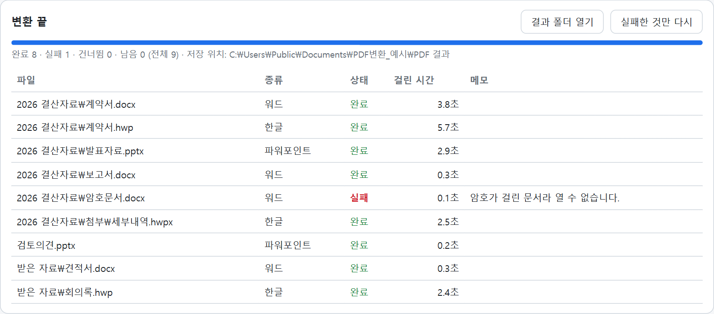
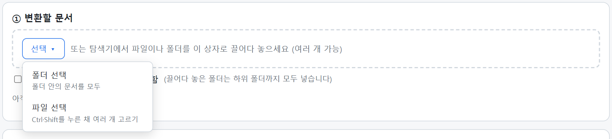

# PDF 일괄 변환 (pdf-batch-convert)

**한글(HWP·HWPX)·워드(DOC·DOCX)·파워포인트(PPT·PPTX)** 문서를 PDF로 한꺼번에 바꿉니다. 폴더나 파일을 고르거나 화면에 끌어다 놓기만 하면 되고, 문서를 하나씩 열 필요가 없습니다. Windows 전용입니다.

📝 소개 글(사용법·화면): [네이버 블로그](https://blog.naver.com/henmoogi/224433484856) · 문의·후기는 블로그 댓글로

👉 **내려받기: [pdf-batch-convert_v2026.10.07.zip](https://github.com/henmoogi/pdf-batch-convert/releases/latest/download/pdf-batch-convert_v2026.10.07.zip)** ([릴리스](https://github.com/henmoogi/pdf-batch-convert/releases/latest))

- 이 PC에 설치된 **한글과 오피스로 직접 변환**합니다. 원래 프로그램에서 'PDF로 저장'하는 것과 같아 글꼴·표·그림이 그대로 유지됩니다.
- **설치할 것이 없습니다.** 윈도우에 기본으로 들어 있는 PowerShell로 동작합니다(파이썬 불필요).
- 파일은 PC 밖으로 나가지 않습니다. 원본은 읽기만 하고 고치거나 지우지 않습니다.

## 쓰는 법

1. zip을 원하는 폴더에 풉니다(압축 파일 안에서 바로 실행하면 동작하지 않습니다).
2. `01 PDF변환_실행.cmd`를 더블클릭합니다. 브라우저에 변환 화면이 열립니다.
3. 변환할 문서를 넣습니다. 여러 번 넣으면 목록에 계속 더해지고, 뺄 문서는 줄 끝의 ✕를 누릅니다.
   - **[선택] → 폴더 선택**: 폴더 안의 문서를 모두 넣습니다. 하위 폴더까지 하려면 '하위 폴더까지 포함'을 체크합니다.
   - **[선택] → 파일 선택**: Ctrl이나 Shift를 누른 채 여러 개를 고를 수 있습니다.
   - **끌어다 놓기**: 탐색기에서 파일이나 폴더를 화면으로 끌어다 놓습니다(폴더는 하위 폴더까지 모두).
4. 저장 위치를 고릅니다. 기본은 **다운로드 폴더**이고, 실행할 때마다 `PDF변환_날짜_시각` 새 폴더에 모읍니다. 원본 옆이나 다른 폴더에도 저장할 수 있습니다(끌어다 놓은 파일은 원래 위치를 알 수 없어 '원본 옆'을 고를 수 없습니다).
5. **[변환 시작]**. 파일별 진행 상황이 표로 나오고, 끝나면 [결과 폴더 열기]로 확인합니다.

처음 실행할 때 Windows의 '**PC 보호**' 창이 뜨면 [추가 정보] → [실행]을 누르세요. 회사에서 서명한 프로그램이 아니라서 나오는 일반적인 경고입니다.

## 필요한 것

| 변환할 문서 | 필요한 프로그램 |
|---|---|
| HWP · HWPX | 한컴오피스 한글 |
| DOC · DOCX | Microsoft Word |
| PPT · PPTX | Microsoft PowerPoint |

화면 맨 위 '준비 상태'에서 어떤 프로그램이 있는지 바로 확인할 수 있습니다. 없는 종류의 문서는 실패로 표시됩니다.

## 이런 경우는

- **한글 '보안 승인' 창**: 한글은 자동 변환 때 문서마다 접근 허용 창을 띄울 수 있습니다. 한컴이 배포하는 보안 모듈(`FilePathCheckerModule`)을 등록하면 뜨지 않습니다. 이 모듈은 한컴의 파일이라 이 패키지에 넣지 않았습니다. 등록하지 않았다면 창이 뜰 때 [모두 허용]을 눌러 주세요.
- **'게시 중' 창**: 워드·파워포인트가 PDF를 만들 때 잠깐 뜨는 진행 창은 오피스 자체 동작입니다.
- **암호가 걸린 문서**는 열 수 없어 실패로 표시됩니다. 저장이 잠긴 한글 **배포용 문서**는 인쇄 방식으로 PDF를 만들어 봅니다.
- **이름이 겹치는 문서**: 같은 폴더의 `계약서.hwp`와 `계약서.docx`는 `계약서_hwp.pdf`, `계약서_docx.pdf`로, 다른 곳에서 고른 같은 이름의 문서는 `_2`를 붙여 나눠 저장합니다.
- **같은 이름의 PDF가 이미 있으면** 건너뜁니다(덮어쓰기는 체크해서 켭니다).
- 한 파일이 **2분 넘게 응답이 없으면** 실패로 표시하고 다음 파일로 넘어갑니다. 끝난 뒤 [실패한 것만 다시]를 누르세요.
- 회사 PC에서 화면은 열리는데 변환이 안 되면, 보안 정책이 PowerShell 스크립트를 막는 경우입니다. 전산 담당자에게 `automation\PDF변환_도우미.ps1` 실행 허용을 요청해 주세요.

## 어떻게 동작하나요 (안전성)

- `01 PDF변환_실행.cmd` → `automation\PDF변환_시작.ps1`이 작은 도우미(`PDF변환_도우미.ps1`)를 창 없이 띄우고, 브라우저로 화면을 엽니다. 예전 버전 도우미가 켜져 있으면 끄고 새로 띄웁니다.
- 도우미는 **이 PC 안(127.0.0.1)에서만** 접속을 받습니다. 실행할 때마다 새로 만드는 일회용 비밀번호가 없는 요청과 다른 웹사이트에서 온 요청은 거절합니다.
- 읽고 쓰는 곳은 **선택 창으로 고른 폴더·파일**과 **다운로드 폴더**뿐입니다. 원본은 고치거나 지우지 않습니다.
- **끌어다 놓은 파일**은 브라우저가 원래 위치를 알려 주지 않아, 화면이 파일 내용을 도우미에 넘기고 도우미가 전용 임시 폴더(`%LOCALAPPDATA%\PDF변환\받은파일`)에 사본을 만들어 변환합니다. 이 사본은 [목록 비우기]를 누르거나 도우미가 꺼질 때 지웁니다. 도우미가 지우는 파일은 이 사본뿐입니다.
- 변환은 도우미가 한글·워드·파워포인트를 창 없이 띄워서 합니다. 끝나면 도우미가 띄운 것만 닫고, 사용자가 쓰던 파워포인트는 닫지 않습니다.
- 모든 파일이 글자로 된 스크립트라 메모장으로 열어 내용을 확인할 수 있습니다.

## 바뀐 점

- **v2026.10.07**: [선택] 메뉴로 파일 여러 개 고르기, 파일·폴더 끌어다 놓기 추가. 여러 번 고른 문서를 한 목록으로 모아 변환. 다른 곳의 같은 이름 문서는 `_2`로 구분. 예전 버전 도우미 자동 교체.
- **v2026.10.06**: 첫 공개.

## 면책

개인이 만든 **비공식** 도구로 한글과컴퓨터·마이크로소프트와 관계가 없습니다. 변환 결과는 사용자가 확인해 주세요. 사용 결과에 대한 책임은 사용자에게 있습니다.

## 라이선스

[MIT](LICENSE) - 제작: 해무기(Henmoogi). 자유롭게 쓰고 고치고 나눌 수 있으며, 재배포할 때는 저작권·라이선스 표시를 함께 넣어 주세요.
